# C Pool - 42 Angouleme

Here are the projects that I completed during the C pool of 42 Angoulême. This intensive program allowed me to discover and master the C programming language through a series of practical projects named "days".
I had never coded in C before this pool and was able to advance in these projects and reach this final result thanks to the knowledge of mathematics that I had acquired during my previous studies, my curiosity, mutual help and my zeal.

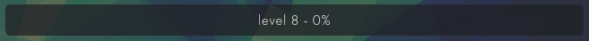


## Objectives of the Pool

The C pool aims to:
- Introduce participants to the fundamentals of the C language.
- Develop problem-solving and algorithmic skills.
- Encourage collaborative learning and autonomy.


## Shell

Those two days are focused on understanding how a shell operates. 

### Shell00
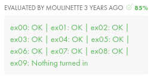

### Shell01
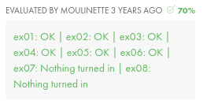

## C
...

### C00


### C01
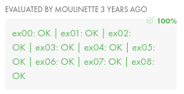

### C02
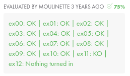

### C03
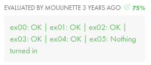

### C04
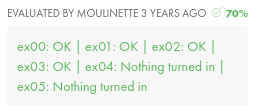

### C05
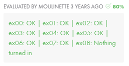

### C06
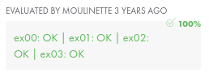

## Rush
... 

### Rush00
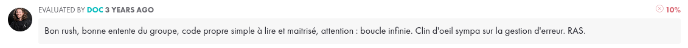

## Rush01
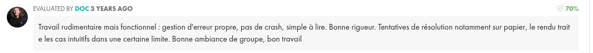

## Rush02
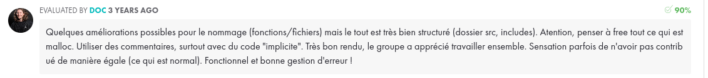


## Installation

To clone this repository and run the projects locally, use the following command:

```bash
git clone https://github.com/painpats/piscine-42.git
